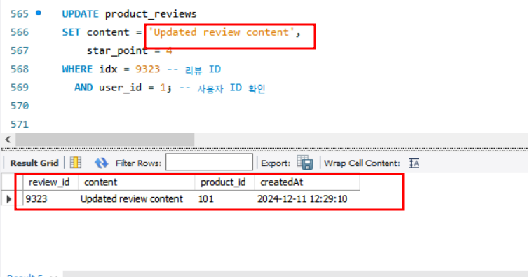
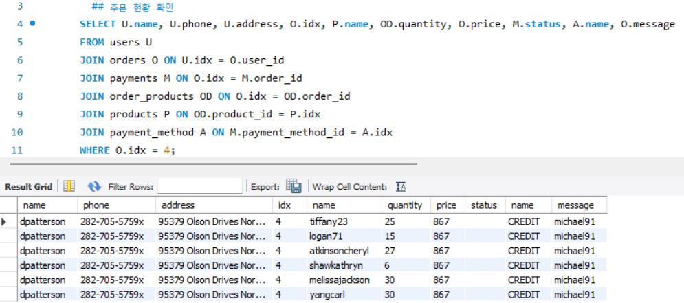

<br>

<h1 align="center" style="color: #FFD675;">🍽️ Eatzzy </h1>

<div align="center">
  
</div>

<h3 align="center">3팀 - Team Matfia </h3>

<br>

## 🕵️ 팀원 소개

<div align="center">

|      |      |   |    |        |           |
| :--------------------------------------------------------: | :--------------------------------------------------------: | :--------------------------------------------------------: | :------------------------------------------------------: | :----------------------------------------------------------: | :--------------------------------------------------------------: |
| 🐰 **박상미**<br/>[@miyad927](https://github.com/miyad927) | 🧶 **박세연**<br/>[@yeon7485](https://github.com/yeon7485) | ⚽ **안규호**<br/>[@Ahngyuho](https://github.com/Ahngyuho) | 🤪 **오승재**<br/>[@dhtmdwo](https://github.com/dhtmdwo) | 🐢 **유승호**<br/>[@seungho99](https://github.com/seungho99) | 🐉 **천태훈**<br/>[@taehoon0518](https://github.com/taehoon0518) |

</div>
<br>

## 🍕 프로젝트 소개

최근 소비자들은 고물가 시대에도 불구하고 유명 스타 셰프들이 운영하는 맛집을 기꺼이 찾아가고 있다.
이는 미식에 대한 관심이 높아지고, 특별한 경험을 위해 비용을 아끼지 않으려는 소비 성향을
반영한 결과이다.

특히 방송 프로그램 '흑백 요리사’의 인기가 이러한 트렌드에 더욱 불을 지피며, 유명 맛집에 대한 수요를
한층 높이고 있다. 그러나 이러한 맛집의 수가 제한적이기 때문에 예약 경쟁이 치열한 상황이다.

**Eatzzy**은 주변 유명 맛집과 음식점을 예약할 수 있는 서비스를 제공하며, 예약에 실패한 고객들을 위해 해당 맛집의 노하우가 담긴 밀키트를 집으로 배달하는 서비스를 추가로 제공한다.

또한, 집에서 편안하게 맛집 음식을 즐기고 싶은 고객이나 거리가 멀어 직접 방문이 어려운 고객들은 밀키트 구매를 통해 식당 방문 여부와 관계없이 맛집의 요리 경험을 간편하게 집에서도 느낄 수 있다.

<br>

## 🍔 기술 스택


<br>

## 🌭 프로젝트 기획안

[프로젝트 기획안](https://docs.google.com/document/d/1yTdJoi2CMtNkD5Jb95j-Yd6mb683Dsed7SkipP3Y_OQ/edit?usp=sharing)

<br>

## 🍣 요구사항 정의서

[요구사항 정의서](https://docs.google.com/spreadsheets/d/1z77Uiao0gpiSDFSjn_s0IWXpiW5H4l5b6ge02403aCI/edit?usp=sharing)

<br>

## 🍥 ERD

[ERD 다이어그램](https://www.erdcloud.com/d/i9Qf2BLnaAYZ4dCrH)


<br>

## 🍡 시스템 아키텍처


<br>

## 🍩 재해 복구 (DR)

<details>
  <summary><b>클러스터 방식을 사용한 이유</b></summary>
  <div markdown="1">
  <br>

  **✔️ 데이터 일관성 유지**

  클러스터는 노드 간 데이터 동기화를 통해 항상 일관된 데이터를 유지한다.  
  이로 인해 특정 서버가 장애로 인해 다운되더라도, 나머지 노드들이 정상적으로 동작하며 서비스의 연속성을 보장하고, 데이터 손실이나 불일치 문제를 최소화한다.

  <br>

  **✔️ 부하 분산**

  유명 맛집 예약 등 실시간 트래픽이 급증하는 상황에도 여러 노드로 분산 처리하여 성능이 저하하는 것을 방지하고, 안정적인 응답 속도를 유지할 수 있다.

  <br>

  **✔️ 쓰기 작업에 강한 구조**

  서비스 특성 상 식당 예약, 상품 구매, 리뷰 작성 등 데이터 쓰기 작업이 많은 환경이기 때문에, 다수의 노드가 병렬로 작업을 처리하므로 높은 쓰기 성능을 제공한다.

  <br> 

  **✔️ 고가용성**

  특정 노드에 장애가 발생하더라도, HAProxy가 정상적인 노드로 트래픽을 분배하여 서비스 중단 없이 시스템을 지속적으로 동작할 수 있다.  
  실시간 예약이나 상품 구매 같은 중요한 서비스에도 안정적인 운영이 가능하다.
  
  <br>
  
  **✔️ 확장성**

  클러스터에 새로운 노드를 추가하여 쉽게 확장할 수 있어, 트래픽이 증가할 때 유연하게 대처가 가능하다.

  </div>
</details>

<br>
<details>
  <summary><b>장애 복구 시나리오</b></summary>
  <div markdown="1">
  <br>

  **✔️ 1대 장애 발생 시**
  - HAProxy가 장애 노드를 감지하고 해당 노드로의 트래픽을 자동으로 차단
  - 클라이언트는 나머지 두 대의 노드를 통해 정상적인 서비스 이용 가능
  - 장애가 해결되면 DB 서버를 재시작하고 클러스터로 다시 연결
  - 클러스터 내 다른 노드에서 장애 노드로 데이터를 자동 동기화하여 최신 상태로 복구
  - 복구 완료 후 HAProxy가 트래픽을 다시 분배하도록 설정  

  <br>

  **✔️ 2대 장애 발생 시**
  - HAProxy가 정상적으로 동작하는 1대의 노드로 트래픽 집중
  - 장애가 해결되면 1대씩 서버를 재시작하고 클러스터로 다시 연결
  - 복구된 노드를 클러스터로 다시 연결하여 데이터를 동기화  

  <br>

  **✔️ 3대 장애 예방**
  - 정기적으로 데이터 백업
  - 보조 DB 클러스터를 구축하여 데이터 손실에 대비
    - 재해 발생 시 보조 클러스터를 즉시 활성화하여 서비스 중단 방지

  <br>
  </div>
</details>
<br> 

## 🥨 SQL

#### ✅ DDL
[DDL SQL 파일](/sql/DDL.sql)


#### ✅ DML
[DML SQL 파일](/sql/DML.sql)

<br>

<details>
  <summary><b>사용자</b></summary>
  <div markdown="1">
  <br>

  회원가입  

  로그인 성공  
  
  
  <br>

  로그인 실패  
  

  <br>
  
  <br>
  </div>
</details>

<br>

<details>
  <summary><b>식당</b></summary>
  <div markdown="1">

  식당 전체 조회 (좋아요순 정렬)  
  

  <br>

  식당 상세 조회  
  
  

  <br>

  식당 검색  
  

  <br>
    
  카테고리 기준 필터링  
  

  <br>
  
  지역 기준 필터링  
  

  <br>

  고객이 좋아요 한 식당 조회  
  

  <br>
  
  점주 식당 등록  
  

  <br>

  점주 식당 예약 조회  
  

  <br>

  - 점주의 식당 조회  
  

  <br>

  식당 등록 요청 거절  
  

  <br>

  식당 등록 요청 수락  
  

  <br>

  식당 카테고리 등록  
  

  <br>
  </div>
</details>

<br> 

<details>
  <summary><b>상품</b></summary>
  <div markdown="1">

  전체 상품 조회  
  

  <br>

  상품 상세 조회  
  

  <br>

  상품 리뷰 확인  
  

  <br>

  상품 리뷰 등록  
  

  <br>

  상품 리뷰 수정  
  
  

  <br>

  상품 리뷰 삭제  
  

  <br>

  상품 바로 구매  
  

  <br>

  상품 카테고리 등록  
  

  <br>

  </div>
</details>

<br>

<details>
  <summary><b>장바구니</b></summary>
  <div markdown="1">

  장바구니 담기  
  
  
  <br>

  장바구니 조회  
  

  <br>

  장바구니 물품 주문  
  
  
  <br>

  </div>
</details>

<br>

<details>
  <summary><b>주문</b></summary>

  전체 주문 내역 조회  
  

  <br>

  주문 상세 내역 조회  
  

  <br>
  
  주문 현황 확인  
  
  
  <br>
  </div>
</details>

<br>

<details>
  <summary><b>배송</b></summary>
  <div markdown="1">

  배송 등록  
  

  <br>

  배송 조회  
  

  <br>
  </div>
</details>

<br>

<details>
  <summary><b>결제</b></summary>
  <div markdown="1">

  결제 수단 선택  
  

  <br>

  카드 등록  
  

  <br>

  

  </div>
</details>

<br>


## SQL 성능 개선

기존 sql은 인기 있는 가게의 정보를 빼오기 위해서는 다섯 개의 테이블을 JOIN 해야했다.

하지만 그랬을 때 성능적인 부분에서 결함이 많았고 해당 정보를 빠르게 받아오기 위해 테이블을 하나 추가해 정보를 저장했다.

<br>

<details>
  <summary><b>수정 전 쿼리</b></summary>

  ```sql
  SELECT stores.idx, store_images.image_path, stores.name, stores_category.name,
          ROUND(AVG(store_reviews.star_point), 1) AS average_star_point,
          COUNT(store_reviews.idx) AS count_reviews,
          stores.address, COUNT(likes.idx) AS count_likes
    FROM stores
    JOIN stores_category ON stores_category.idx = stores.category_id
    JOIN store_images ON store_images.store_id = stores.idx
    JOIN store_reviews ON store_reviews.store_id = stores.idx
    JOIN likes ON stores.idx = likes.store_id
    GROUP BY stores.idx
    ORDER BY count_likes DESC
    LIMIT 10;
  ```

</details>

<br>

<details>
  <summary><b>수정 후 쿼리</b></summary>

  ```sql
  SELECT
      store_id, image_path, store_name,
      category_name, average_star_point,
      count_reviews, count_likes, 
      address, allowed
  FROM stores_summary
  WHERE allowed = 'Yes'
  ORDER BY count_likes DESC
  LIMIT 10;
  ```
</details>

<br>

<details>
  <summary><b>새로 도입한 테이블</b></summary>

  ```sql
  CREATE TABLE stores_summary (
      store_id INT PRIMARY KEY,
      image_path VARCHAR(255),
      store_name VARCHAR(255),
      category_name VARCHAR(255),
      average_star_point DECIMAL(3, 1),
      count_reviews INT,
      count_likes INT,
      address VARCHAR(255),
      allowed ENUM ('Yes', 'No', 'Waiting')
  );
  ```

</details>

<br>

#### ✅ 수정 전 CPU 사용량


<br>

#### ✅ 수정 후 CPU 사용량


<br>

#### ✅ 수정 전 작동 시간


<br>

#### ✅ 수정 후 작동 시간

