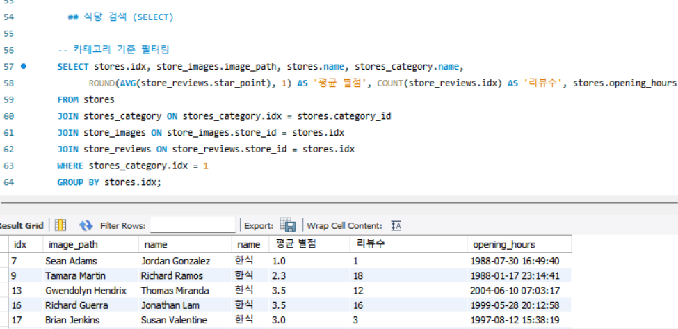

 

<h1 align="center">🍽️ Eatzzy </h1>

  

<h3 align="center">3팀 - Team Matfia </h3>

 

## 🕵️ 팀원 소개

|           |     |           |         |             |                 |
| :-----------------------------------------------------: | :--------------------------------------------------------: | :-----------------------------------------------------: | :---------------------------------------------------: | :-------------------------------------------------------: | :-----------------------------------------------------------: |
| **박상미** [@miyad927](https://github.com/miyad927) | 🐱 **박세연** [@yeon7485](https://github.com/yeon7485) | **안규호** [@Ahngyuho](https://github.com/Ahngyuho) | **오승재** [@dhtmdwo](https://github.com/dhtmdwo) | **유승호** [@seungho99](https://github.com/seungho99) | **천태훈** [@taehoon0518](https://github.com/taehoon0518) |

 

## 🍕 프로젝트 소개

최근 소비자들은 고물가 시대에도 불구하고 유명 스타 셰프들이 운영하는 맛집을 기꺼이 찾아가고 있다.
이는 미식에 대한 관심이 높아지고, 특별한 경험을 위해 비용을 아끼지 않으려는 소비 성향을
반영한 결과이다.

특히 방송 프로그램 '흑백 요리사’의 인기가 이러한 트렌드에 더욱 불을 지피며, 유명 맛집에 대한 수요를
한층 높이고 있다. 그러나 이러한 맛집의 수가 제한적이기 때문에 예약 경쟁이 치열한 상황이다.

**Eatzzy**은 주변 유명 맛집과 음식점을 예약할 수 있는 서비스를 제공하며, 예약에 실패한 고객들을 위해 해당 맛집의 노하우가 담긴 밀키트를 집으로 배달하는 서비스를 추가로 제공한다.

또한, 집에서 편안하게 맛집 음식을 즐기고 싶은 고객이나 거리가 멀어 직접 방문이 어려운 고객들은 밀키트 구매를 통해 식당 방문 여부와 관계없이 맛집의 요리 경험을 간편하게 집에서도 느낄 수 있다.

 

## 🍔 기술 스택

 

## 프로젝트 기획안

[프로젝트 기획안](https://docs.google.com/document/d/1yTdJoi2CMtNkD5Jb95j-Yd6mb683Dsed7SkipP3Y_OQ/edit?usp=sharing)

## 요구사항 정의서

[요구사항 정의서](https://docs.google.com/spreadsheets/d/1z77Uiao0gpiSDFSjn_s0IWXpiW5H4l5b6ge02403aCI/edit?usp=sharing)

## ERD

[ERD 다이어그램](https://www.erdcloud.com/d/i9Qf2BLnaAYZ4dCrH)

## 시스템 아키텍처

## 재해 복구 (DR)

## SQL

사용자

회원가입

식당

고객이 좋아요 한 식당 조회

식당 상세 조회

식당 전체 조회_좋아요순 정렬

식당 검색

점주 식당 등록

점주 식당예약 조회

점주의 식당 조회

식당등록거절

식당등록수락

식당카테고리등록

상품

상품 리뷰 확인

상품 리뷰 등록

상품 확인

상품 카테고리 등록

장바구니

장바구니 담기

장바구니 조회

주문

전체 주문 내역 조회

주문 상세 내역 조회

주문 현황 확인

배송

결제

## SQL 성능 개선
